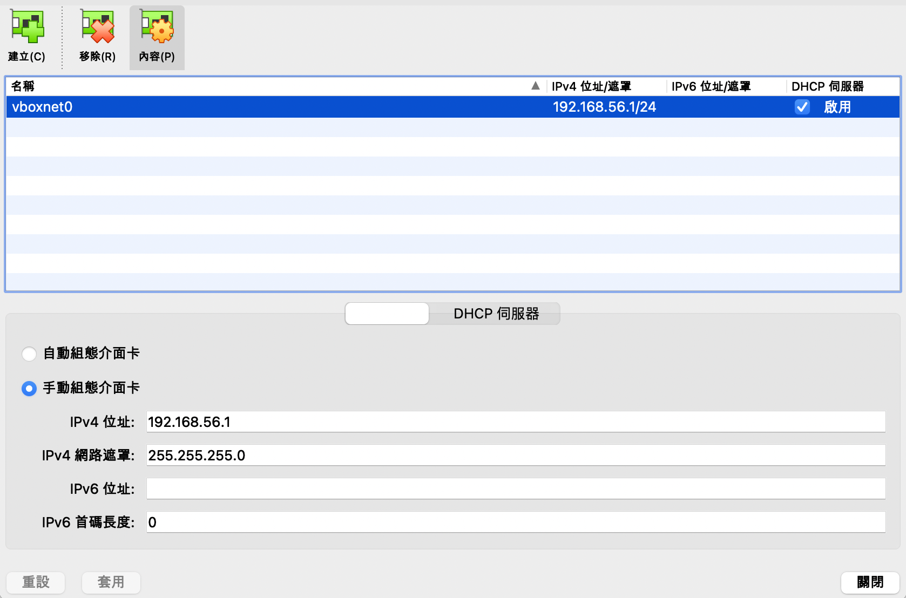
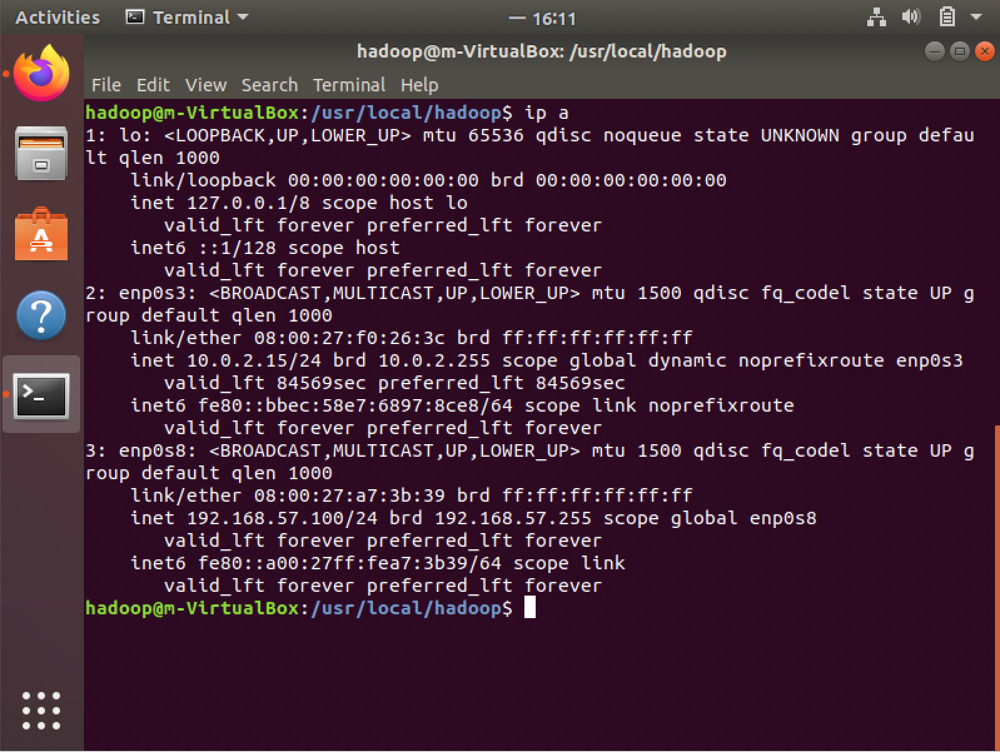
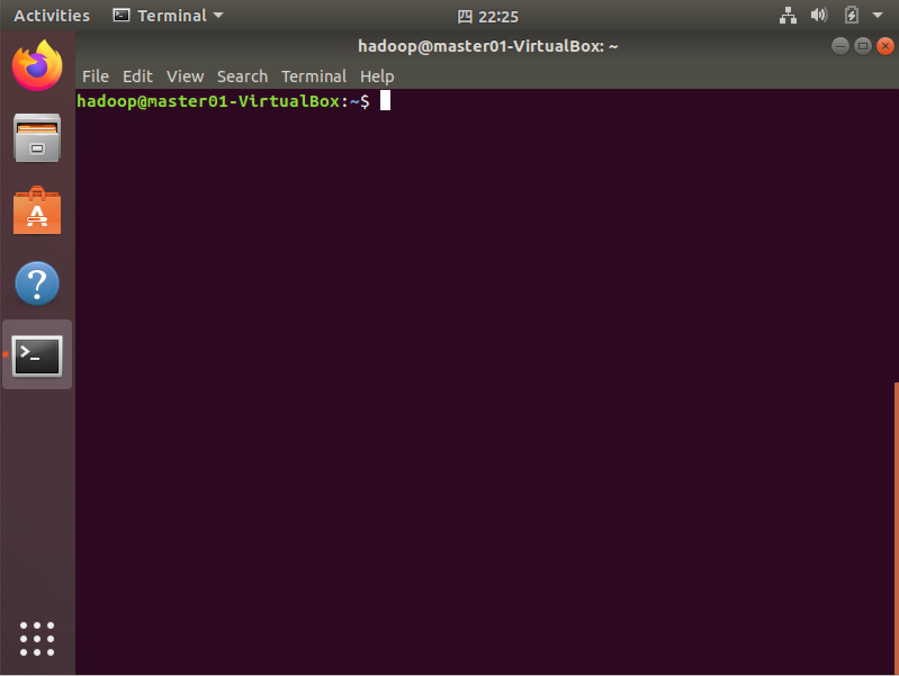
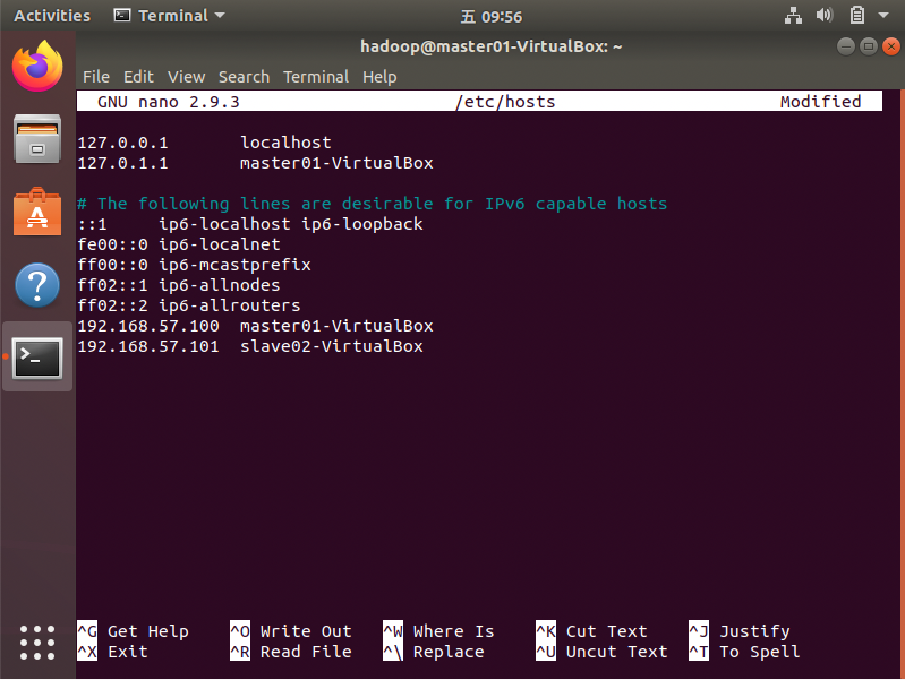
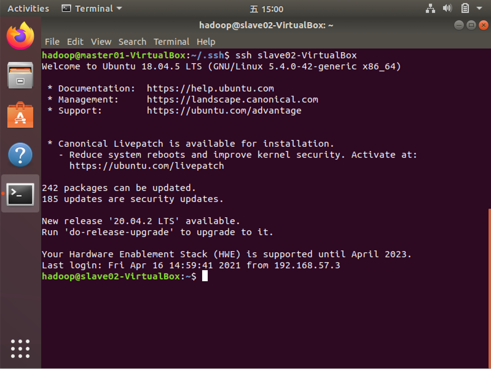
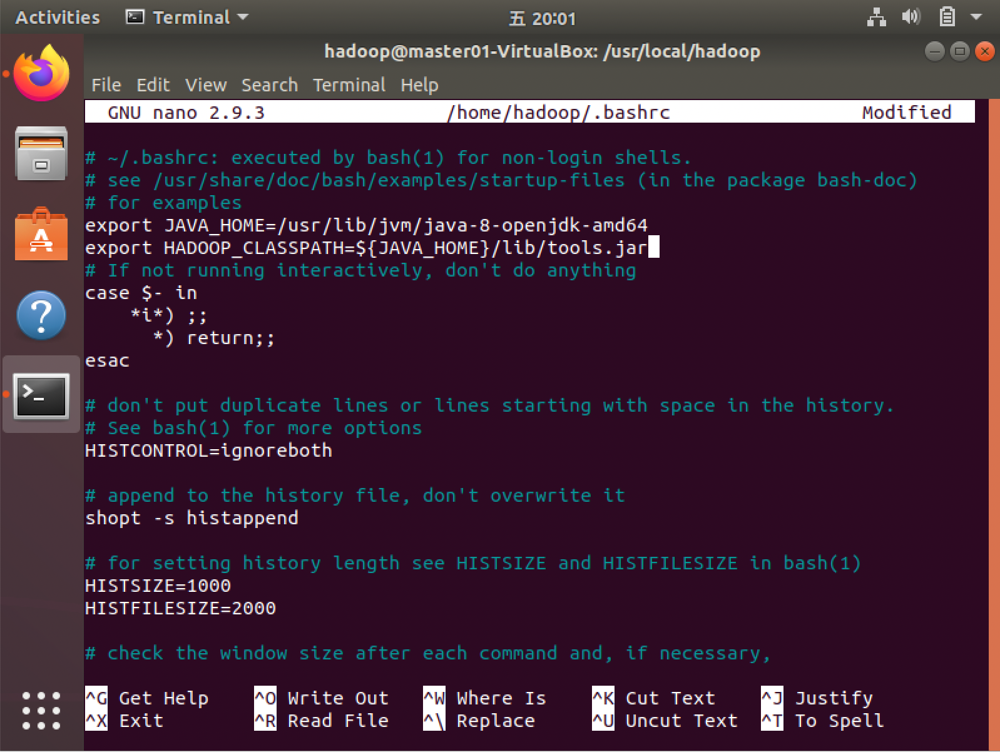
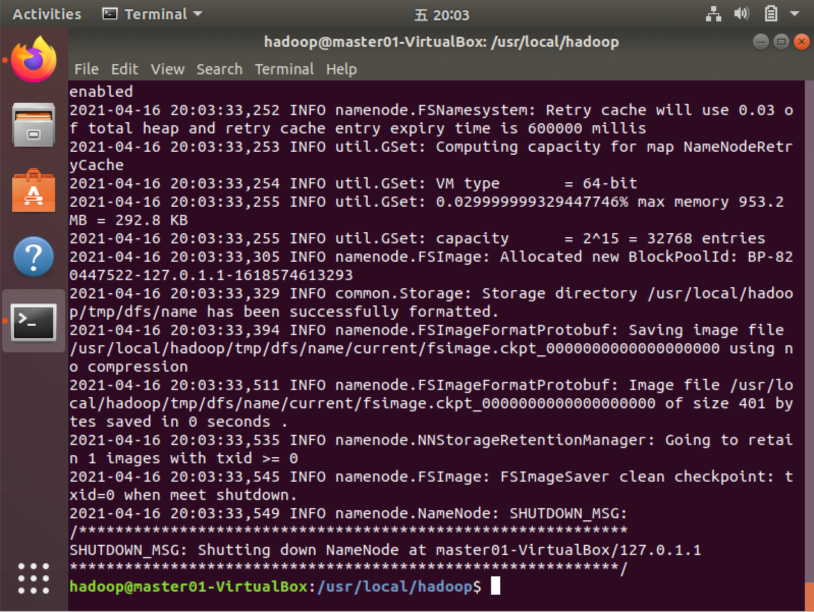
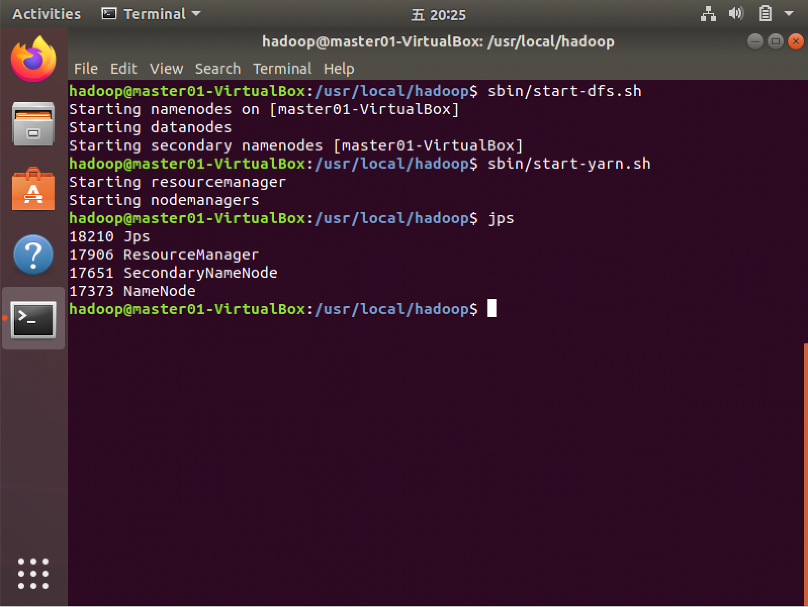
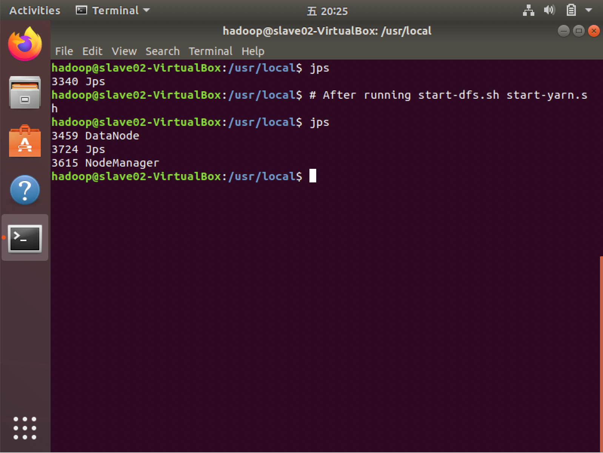

# Hadoop Learn
## 建置
Hadoop is a distributive system. We need more than one machine to 
test it.

Here I use VirtualBox to build two virtual machines with ubuntu 
version ubuntu-18.04.5-desktop.

### Ubuntu安裝選項
* Minimal installation
* Other options: (None)
* Erase disk and install Ubuntu

### Virtual machine settings
VirtualBox使用方法：（略過）
[VirtualBox](https://www.virtualbox.org)
* After installing ubuntu desktop, connect them by entering "主機網路管理員"
and press "建立主機網路".

* For two virtual machines, 設定>網路>介面卡2>附加到：僅限主機介面卡

## 網路設定+安裝SSH+增加使用者
Open terminal. -> Run commands in the shell script.
*"apt-get update"*, *"set netcard"*, *"install ssh"*, and *"add user"*.  

**On master machine**
使用`$ip a`檢查192.168.56.的網路名稱是否為enp0s8，如果是其他名稱以下全部enp0s8都換成該名稱。


```shell=
$sudo apt-get update

$sudo echo -e "auto enp0s8\niface enp0s8 inet static\naddress 192.168.56.100\nnetmask 255.255.255.0\nnetwork 192.168.56.0" >> /etc/network/interfaces
$sudo ifup enp0s8

# install ssh
$sudo apt-get install openssh-server

### Create new account for running hadoop ###
$sudo useradd -m hadoop -s /bin/bash
$sudo passwd hadoop
$sudo adduser hadoop sudo
```
Change to another account.  

**On slave01 machine**
```shell=
$sudo apt-get update

$sudo echo -e "auto enp0s8\niface enp0s8 inet static\naddress 192.168.56.101\nnetmask 255.255.255.0\nnetwork 192.168.56.0" >> /etc/network/interfaces
$sudo ifup enp0s8

# install ssh
$sudo apt-get install openssh-server

### Create new account for running hadoop ###
$sudo useradd -m hadoop -s /bin/bash
$sudo passwd hadoop
$sudo adduser hadoop sudo
```
Change to another account.<br/>


登出並登入剛剛設定的使用者，之後hadoop操作都使用此使用者。<br/>


### 安裝java+安裝hadoop+增加hosts+SSH設定
* 安裝jdk  
因為Hadoop是java的程式
```shell=
sudo apt-get install openjdk-8-jdk
```
* 安裝hadoop
```shell=
sudo wget http://downloads.apache.org/hadoop/common/hadoop-3.3.0/hadoop-3.3.0.tar.gz
sudo tar -zxvf ./hadoop-3.3.0.tar.gz -C /usr/local
cd /usr/local
sudo mv hadoop-3.3.0 ./hadoop
sudo chown -R hadoop:hadoop ./hadoop
```
* 增加hosts  
為了以後以名字代替輸入ip。
```shell=
sudo nano /etc/hosts
```
Append master01 ip, slave02 ip, slave03 ip,...


* SSH設定  
（這裡沒有寫在shell script裡面）
*在master主機*裡設定ssh連線<br/>
這樣以後master登入slave就不用輸入密碼
```shell=
mkdir ~/.ssh
cd ~/.ssh
ssh-keygen -t rsa
cat ~/.ssh/id_rsa.pub >> ~/.ssh/authorized_keys
scp ~/.ssh/id_rsa.pub hadoop@slave02-VirtualBox:/home/hadoop/
scp ~/.ssh/id_rsa.pub hadoop@slave03-VirtualBox:/home/hadoop/
# ......
```

*在slave主機*  
把SSH公鑰保存到對應位置
```shell=
cat ~/id_rsa.pub >> ~/.ssh/authorized_keys
```

可在master測試是否有辦法無密碼登入


### 配置分散式系統
在master機器，進入hadoop資料夾
```shell=
cd /usr/local/hadoop/etc/hadoop
```
* workers
```shell=
sudo nano workers
```
按照要工作的機器，改變內容。（比如要工作的機器是slave01-VirtualBox、slave02-VirtualBox、slave03-VirtualBox）
則改成以下內容
```
slave01-VirtualBox
slave02-VirtualBox
slave03-VirtualBox
```
* core-site.xml
把`<configuration></configuration>`改成以下內容<br/>
（**master01-VirtualBox**部分改成自己機器的名稱）
```
<configuration>
    <property>
        <name>fs.defaultFS</name>
        <value>hdfs://master01-VirtualBox:9000</value>
    </property>
    <property>
        <name>hadoop.tmp.dir</name>
        <value>file:/usr/local/hadoop/tmp</value>
        <description>Abase for other temporary directories.</description>
    </property>
</configuration>
```

* hdfs-site.xml
把`<configuration></configuration>`改成以下內容<br/>
（**master01-VirtualBox**部分改成自己機器的名稱）<br/>
（`dfs.replication`是檔案份數，增加容錯、資料備份、讀取速度等）
```
<configuration>
    <property>
        <name>dfs.namenode.secondary.http-address</name>
        <value>master01-VirtualBox:50090</value>
    </property>
    <property>
        <name>dfs.namenode.name.dir</name>
        <value>file:/usr/local/hadoop/tmp/dfs/name</value>
    </property>
    <property>
        <name>dfs.datanode.data.dir</name>
        <value>file:/usr/local/hadoop/tmp/dfs/data</value>
    </property>
    <property>
        <name>dfs.replication</name>
        <value>3</value>
    </property>
</configuration>
```
* mapred-site.xml
把`<configuration></configuration>`改成以下內容
```
<configuration>
    <property>
        <name>mapreduce.framework.name</name>
        <value>yarn</value>
    </property>
    <property>
        <name>yarn.app.mapreduce.am.env</name>
        <value>HADOOP_MAPRED_HOME=/usr/local/hadoop</value>
    </property>
    <property>
        <name>mapreduce.map.env</name>
        <value>HADOOP_MAPRED_HOME=/usr/local/hadoop</value>
    </property>
    <property>
        <name>mapreduce.reduce.env</name>
        <value>HADOOP_MAPRED_HOME=/usr/local/hadoop</value>
    </property>
</configuration>
```
* yarn-site.xml
```
<configuration>
    <property>
        <name>yarn.resourcemanager.hostname</name>
        <value>master01-VirtualBox</value>
    </property>
    <property>
        <name>yarn.nodemanager.aux-services</name>
        <value>mapreduce_shuffle</value>
    </property>
</configuration>
```
設定`JAVA_HOME`
```shell=
nano ~/.bashrc
```

```shell=
source ~/.bashrc
```
接著把hadoop打包給其他機器，免去再次設定：
```shell=
# cd /usr/local/
sudo tar -zcf ./hadoop.tar.gz ./hadoop
scp ./hadoop.tar.gz slave01-VirtualBox:/home/hadoop
scp ./hadoop.tar.gz slave02-VirtualBox:/home/hadoop
# ...
```
傳送過去以後，去workers機器解壓縮
```shell=
sudo tar -zxf ~/hadoop.tar.gz -C /usr/local
```

## Hadoop啟動
* 切換到hadoop資料夾(`cd /usr/local/hadoop/`)
* **第一次啟動**要format
```shell=
bin/hdfs namenode -format
```

* 之後要啟動執行以下兩個指令就好
```shell=
sbin/start-dfs.sh
sbin/start-yarn.sh
```

* 檢查服務程序
`jps`
master01-VirtualBox

slave02-VirtualBox


新增資料夾
```shell=
bin/hdfs dfs -mkdir /user
bin/hdfs dfs -mkdir /user/hadoop
```

## Rference
[Hadoop 簡易架設不求人](http://www.cc.ntu.edu.tw/chinese/epaper/0036/20160321_3609.html)
[Hadoop 3.2.0 安裝教學與介紹](https://medium.com/@sleo1104/hadoop-3-2-0-安裝教學與介紹-22aa183be33a)
[Hadoop: Setting up a Single Node Cluster.](https://hadoop.apache.org/docs/stable/hadoop-project-dist/hadoop-common/SingleCluster.html)
